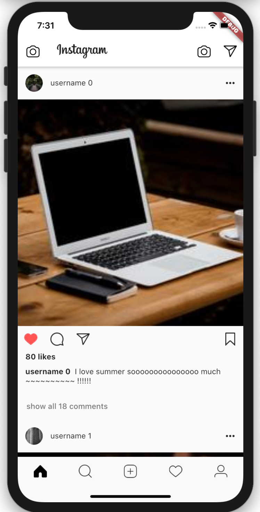
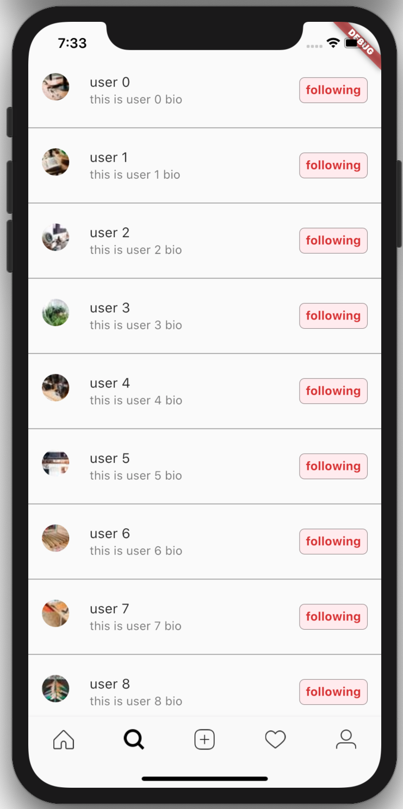
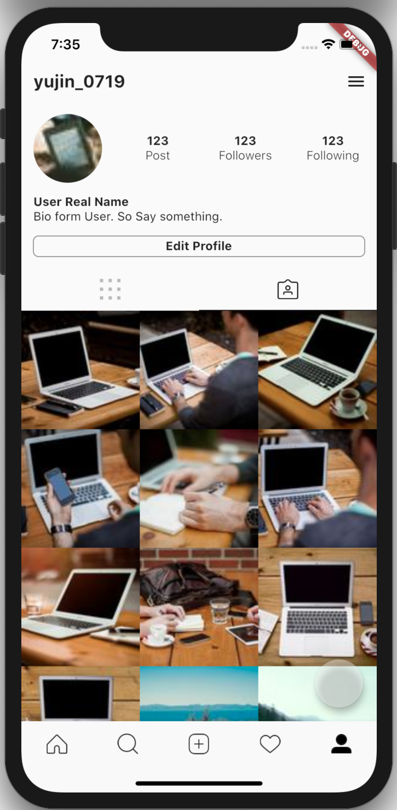
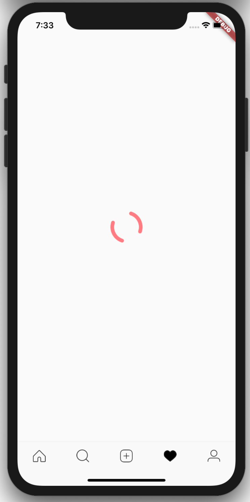
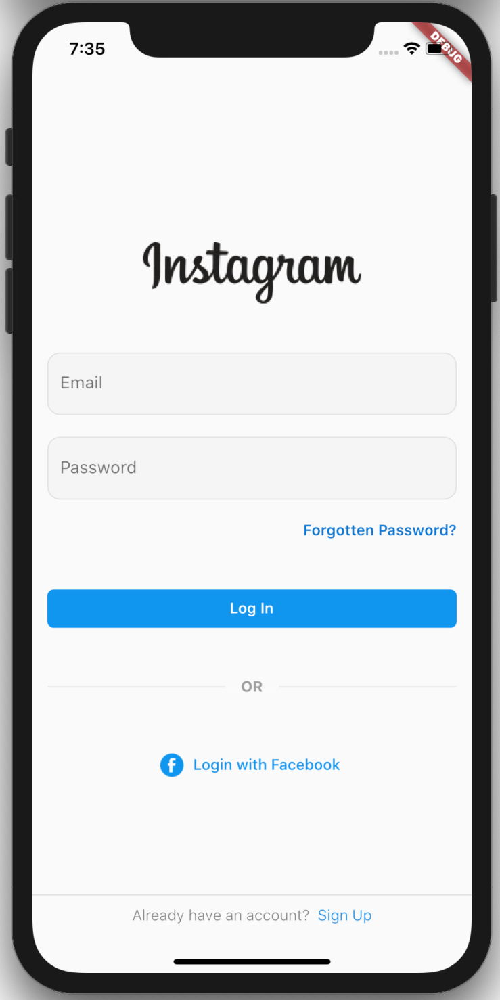
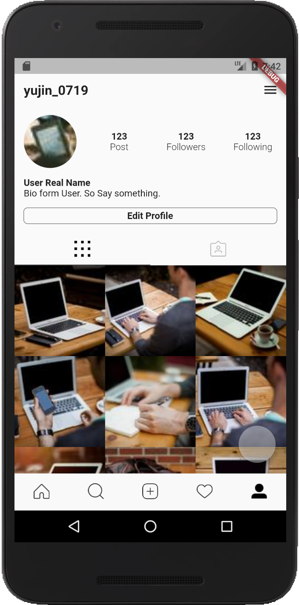

# Instagram 클론

   

## Page 

 page | 화면 
---|---
homepage| 
search list| 
profile|
loading|
login|
안드로이드 홈화면|

## Development Environment & Language
- Android studio 3.5.3
- Version 11.5 
- Flutter 1.17.4
- <strong>dart</strong>

 

